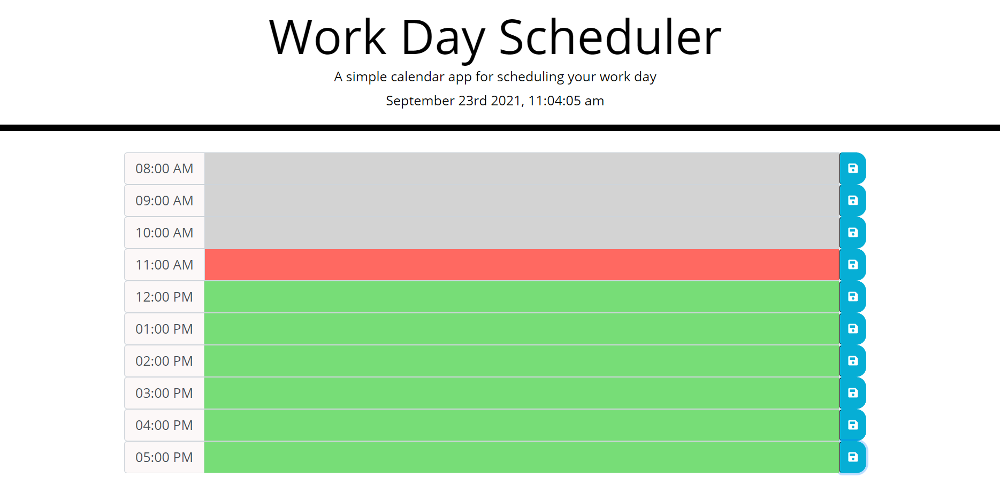
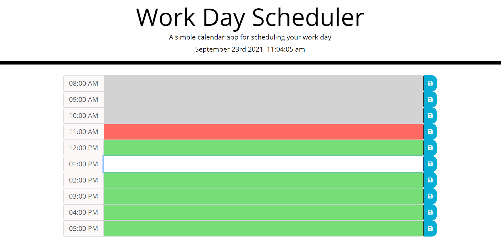
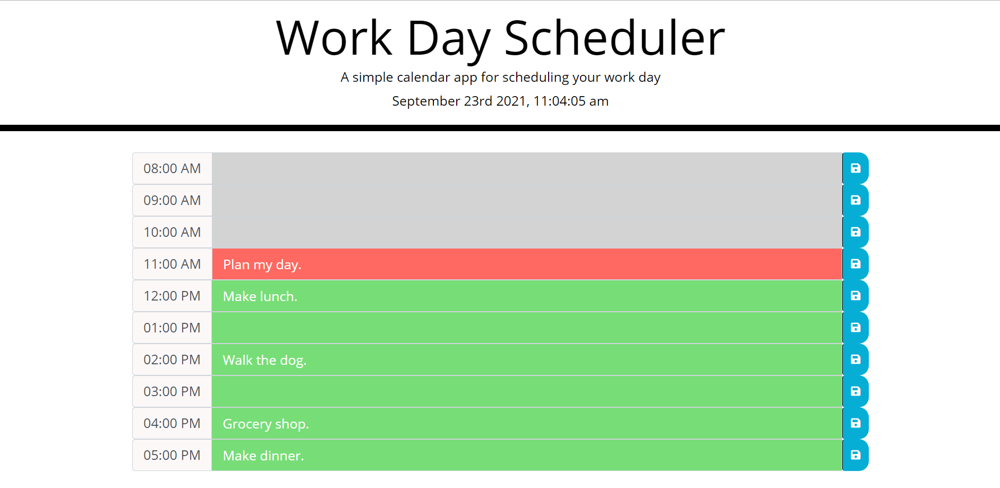

# Welcome to MY WORK DAY SCHEDULER for Challenge 5!

## This challenge entails creating a Work Day Scheduler that will utilize HTML, CSS, and JavaScript with some help from JQuery, Bootstrap, and Moment!

 ### Once the Work Day Scheduler opens, you will be notified of the current day and time at the header of the page. 
 

 ### Next you will see 10 hour blocks of time beginning at 8AM and ending at 5PM to plan your Work Day Schedule. Depending on the current time, you will see gray blocks for past time, a red block for current time, and green blocks for future time.
 

### When you click on a time block to enter your text, it turns white.
 

 ### When you enter text into your Work Day Scheduler and hit the save button at the right, your Schedule is saved even if the page is refreshed.
 

### Click here to view my portfolio: https://jamwil1226.github.io/work-day-scheduler/

### I hope you enjoy using this Work Day Scheduler! I welcome all contributions and feedback!

### I look forward to hearing from you!

### _Jamie Williams_ 

